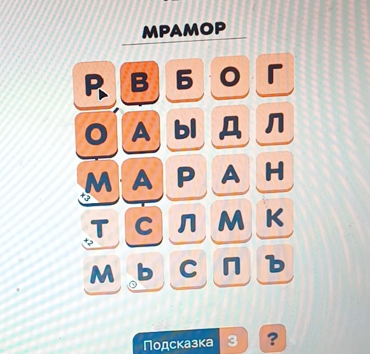
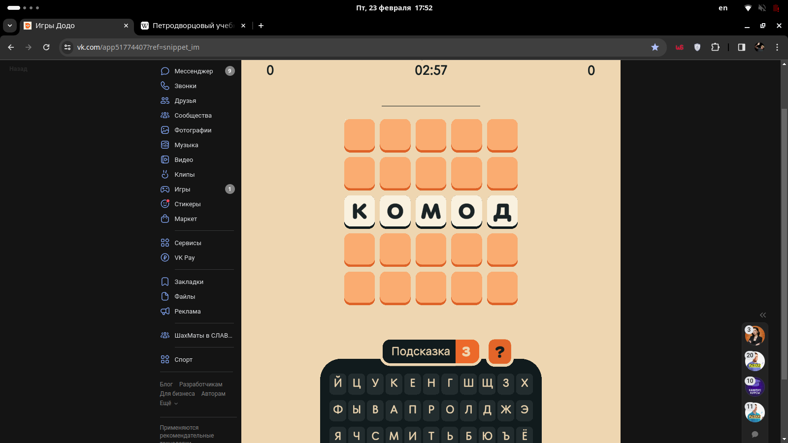

# Балда от Dodo Пиццы

*решил сказать в начале.  Тут я буду писать код!!! и делать это на Python*

Как-то друг мне показал пост ВКонтакте из паблика Додо Пиццы.  Там говорилось как-то так

> Мы запускаем нашу игру ["Балда"](https://vk.com/app51774407).  В течении (~месяца) за люди будут получать очки.  Первые ~3 аккаунта в общем рейтинге получат годовой запас Пиццы.

Вот я в поисках наживы начал писать бота.  Чего я добился?  При заходе в игру вы можете посмотреть на каком вы месте в ОБЩЕМ рейтинге и первые 20 человек в этом общем заходе.  Так вот.  Я был в этом рейтинг 😎, а на каком месте... Неважно, главное что люди со ВСЕЙ страны заходили и видели мою мордашку, дааа. Ну сейчас (я зашёл спустя 3 месяца) я на 29 месте СРЕДИ ВСЕХ АККАУНТОВ ИГРЫ (всего их на момент просмотра 177'000)

Вообще такое количество очков было набрано ЗА ОЧЕНЬ МАЛЕНЬКИЙ СРОК, когда у других было очков где-то миллион, я только об этой игре узнал.  Думаю если я бы сел писать бота чуть пораньше, я бы там всех порвал.  Блин план был такой: я запущу на своём компе, друг на своём, а другой друг на своём, но второму другу было видимо обще пофиг.  Тем более как стало ясно, если одновременно 2 человека с одного аккаунта сыграли партию, то считают одну партию, что логично.

Кстати...  Если представители Додо читают это, то пожалуйста... не убивайте меня.  Блин пж.  А было круто если вы бы, ну, привезли мне бы один грузовик пиццы. ссссс..

Окей.  Дальше я буду описывать как я написал этого Франкинштейна.  Кстати писать статью я начал 29 июня 2024, спустя 4 месяца.

Я давно читаю habr.  Статьи где люди пишут код мне ОЧЕНЬ нравятся, я от них прусь.  Только именно сейчас есть такая проблема.  Такие статьи становятся интересными только ТОГДА, КОГДА автор описывает не просто буквы, которые он там когда-то напечатал, а когда автор рассказывает о всех трудностях, о всех свалившихся проблемах, когда вместе с автором думаешь над решением задачи.  Так вот, этот пост не такой, ну или вряд ли таким получится, хоть я буду стараться.  Код я писал *ОЧЕНЬ* давно, я нифера не помню

Но перед кодом, хотя бы об игре расскажу

## Правила Игры

Идея игры такая (кстати прикольная), советую сыграть.  Вот [ссылка](https://vk.com/app51774407), второй раз кидаю:

1. Вы выбираете слово из 5 букв
2. Вам показывают таблицу 5x5, где в 3 сверху строчке уже вписано выданное вам слово.  Ваша задача за 3 минуты заполнить эту таблицу буквами, собирая в ней слова.  Слова можно выбирать как в игре Филлворды (почти).  Начиная с любого символа вы можете начать по буквам выделять слово, буквы вы можете выделять, начиная с клетки любую соседнюю (слева, справа, снизу, сверху или где-то по-диагонали) букву.  Когда вы соединили буквы и получили слово (существующее), вы получаете за него очки.



Если за эти 3 минуты вы использовали все буквы в составлении слов, то вы получаете очки умноженные на 2

3. Потом происходит второй раунд, отличающийся лишь тем, что не надо самим заполнять буквы, они уже есть.

Блин.  Ладно.  Погнали химичить

## Поиск всех слов в таблице

Ладно. Начинаем с чистого листа. Что дано? Ничего, абсолютно.

Писать я буду на Python, ведь знаю, что такая задача прям будто создана специально для этого языка. Все библиотеки для такого рода задач уже написаны на Python. Плюс его я знаю просто идеально. Все видели (наверное все) видео Хауди Хо, где он реализует какого-нибудь бота-рыбака для Террарии.

Начинать писать бота я буду с самого простого.  Задача такая:

> дана таблица из букв (5 на 5), найти нужно все возможные слова в этой таблице, причём тупо выводить все слова недостаточно.  Нужно сохранять как-нибудь путь, который позволяет воспроизвести это слово в игре.

Путь буду хранить самым наивным способом: буду сохранять список из координат (каждая координата это кортеж `(x, y)` - координаты буквы в таблице).

Отлично.  Теперь советую вам решить эту задачу в уме самостоятельно.

Надеюсь вы сейчас реально думайте, а не просто читаете это предложение.

Ладно.

Времени было предостаточно, передаём листочки.

Решений было наверное много, наверное даже среди них есть какое-то большое количество хороших.  Но а собственно я как серьёзный программист, решающий *LeetCode*, регулярно участвующий в контестах *Codeforces*, не пропускающий ни одного стрима Tsoding, лично знакомый с Линусом Торвальдсом, участвующий в разработке Манхетанского Проекта(не всему стоит верить на 100%), сразу придумал рабочее решение(возможно оно тупое): я буду просто перебирать ВСЕ слова, которые только возможно составить.  Возможно вы скажете, что это невозможно... и... будете правы.  Алгоритм такой: буду начинать с ячейки `(i, j)` перебирать все возможные буквы, следующие после этой ячейки, при этом перебирать все возможные ячейки с уже той ячейки, при этом важно не проверять одни и те же буквы несколько раз, поэтому буду поддерживать массив `_used[][]`, где `_used[i][j] == true`, когда букву/ячейку `(i, j)` мы уже используем как часть слова.

Обще это называется dfs, а точнее его разновидность [floodfill](https://usaco.guide/silver/flood-fill?lang=py "я же знаю, что вы не будете на это нажимать")

Ладно.  Все эти понятия, `dfs` (причём он тут, это же не Граф!?).  Вы уже заскучали??  А вот Марго Робби в пенной ванне попытается вам всё объяснить


> Любое слово состоит из букв.  А в данном случае, любая буква ещё обладает какой-то координатой в этой таблице.  Левая верхняя буква это `(0, 0)`, нижняя правая это `(0, 4)` или `(4, 0)`.  Какая чёрт его возьми впрочем то разница. `(x, y)` или `(y, x)`!  Кому впрочем до этого есть дело.

> Так вот.  Задача стоит простая: найти все возможные пути типа `[(0, 1), (1, 0), (1, 1), ...]`, которые если соединить их как нужно воспроизводят существующее слово.

> Можно перебирать все возможные `(i, j)` это его первый элемент.  Допусти `(i, j) = (0, 0)`, тогда мы можем взять новую букву, это будет либо `(1, 0)` или `(0, 1)`, ну или `(1, 1)`.  Т.е. запускаем три раза сами себя.  Это черт-возьми рекурсия.  Клааас!  Ну нужно также сохранять какое слово (строка, `string` ~~типо стринги~~) соответствует данному путю, будем при переходе от буквы к букве добавлять символ ячейки к строке, а если это слово ещё и реальное русское, то сохраняем этот путь (список координат) и говорим что это слово мы уже использовали (вводить одно и тоже слово хоть и несколькими путями бессмысленно — очков всё равно не дадут).  Для первого говорим в начале, что `_used[i][j] = true` (для функций, которые вызываем внутри), а потом возвращаем `_used[i][j] = false` (для функций-родителей)

> Ну что?  Дошло?  А теперь идите вон

Окей.

Код выглядит таким образом

```python
def _dfs(i, j, path, word: str):
    if i < 0 or i >= n or j < 0 or j >= n:  # заходит за границы, нафиг
        return
    if _used[i][j]:  # если "путь слова" это змейка, то она врезалась в себя же (бля что)
        return

    word += _table[i][j]

    if _is_word_exists(word) and word not in _checked_words:
        _paths.append(path)
        _checked_words.add(word)

    if len(word) == MAX_WORD_LEN:  # MAX_WORD_LEN = 8
        return

    _used[i][j] = True  # следующие вызовы _dfs не будут использовать букву i, j

    for di, dj in _deltas:
        _dfs(i + di, j + dj, path=path + [(i + di, j + dj)], word=word)

    _used[i][j] = False
```

(оригинальный код : по [ссылки](https://github.com/semenInRussia/dodobot/blob/main/src/worder.py "worder.py"))

Здесь `_deltas` это просто список `(di, dj)` величины на которые могут измениться `x` и `y` следующей ячейки

```python
_deltas = [
    (0, -1),  # left
    (0, +1),  # right
    (-1, 0),  # up
    (+1, 0),  # down
    # диагональные
    (+1, -1),  # down-left
    (-1, -1),  # up-left
    (-1, +1),  # up-right
    (+1, +1),  # down-right
]
```

Кстати, функция `_is_word_exists(wrd)` тоже интересная.  Точнее я хотел её сделать такой.  По сути она выглядит так:

```python
def is_word_exists(wrd):
    return wrd in words
```

Где `words` это `set` всех возможных слов, я их храню в отдельном файле `dict.txt` (просто список слов, который я где-то скачал) и читаю в начале программы в `set`.  Ну обще я хотел использовать до этого такую структуру, как Бор (префиксное дерево) (ссылки ищите сами).  Это бы сэкономило кучи памяти, но и так всё норм работает.

Кстати о скорости.  Данный код работает очень быстро, а это же всё-таки Python.  Для меня это было шоком.  Почему это не занимает годы.  Потому что я сделал ограничение на длину слова, если мы смотрим на слово длинной 8 букв, то нет особого смысла идти дальше 9букв это too much.  Просто останавливаемся здесь.  Таким образом, по моим глупым расчётам такой обход в грубо займёт $8^8$ итераций для каждой буквы из 25.

Блин.  Обще это скучная часть.  Дальше будет интереснее (я надеюсь), но уже сейчас есть хоть какой-нибудь рабочий прототип.  **В ручную** заходите в игру, **В ручную** вводите таблицу, получаете список существующих слов и **сами** выделяете их мышкой.

## Читаем таблицу

Что нужно уметь делать после того, как научились искать слова в таблице?  Не знаю как вы, но я решил почему то научиться читать буквы, которые есть в таблице.  Узнал это, посмотрев историю коммитов, на самом деле очень интересно смотреть как эволюционирует ваш код.  Ладно

Хорошо.

Чтение текста, ну обще то как бы сложная задача.  Я решил действовать популярным методом: буду использовать *Teseract*.  До этого надо уметь делать скриншоты, а на этом останавливаться долго я не буду.  Скажу лишь что для операций над фотографиями буду юзать `Pillow`, чтобы делать скриншоты, использую `mss`

```python
def screen() -> Image.Image:
    with mss() as s:
        s.shot()
        return Image.open("monitor-1.png")
```

(тут функция возвращает объект `Pillow.Image`, который читает скриншот первого монитора, т.е. читать текст мы будем только при условии, что игра открыта на первом мониторе)

Таблица выглядит так если что.


